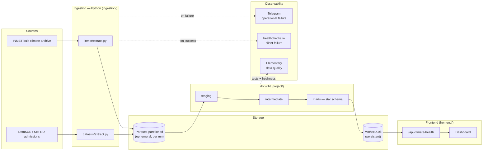

# Climate x Public Health Observatory

Does climate variation correlate with spikes in respiratory hospital admissions? An
end-to-end, tested, observed data pipeline that ingests real Brazilian climate and public
health data to find out — for Curitiba, Paraná, over the last 24 months.

**🔗 Live dashboard:** not yet deployed — see [Running locally](#running-locally) to run it
yourself in the meantime.


## Architecture



Two GitHub Actions workflows drive this: `ci.yml` validates every pull request (lint, unit
tests, `dbt parse`/`compile`); `daily-pipeline.yml` runs the real pipeline (INMET daily,
DataSUS weekly, `dbt build`, the Elementary report, then a healthchecks.io ping on success
or a Telegram alert on failure).

## Architecture Decisions

Every non-obvious trade-off in this project is written down as an ADR, including *why not*
the more common alternative:

| ADR | Decision |
|---|---|
| [0001](docs/adr/0001-duckdb-motherduck-choice.md) | DuckDB + MotherDuck over a cloud data warehouse or managed Postgres |
| [0002](docs/adr/0002-cron-vs-orchestrator.md) | GitHub Actions cron over Airflow/Dagster |
| [0003](docs/adr/0003-three-layer-observability.md) | Three separate observability layers, not one general-purpose tool |
| [0004](docs/adr/0004-scaling-strategy.md) | What would actually change to scale to all of Brazil, 5+ years |
| [0005](docs/adr/0005-inmet-bulk-archive-over-live-api.md) | INMET's bulk archive instead of its live API, after the live API proved unreliable in production |

## Running locally

**Prerequisites:** Python 3.11–3.13, [Poetry](https://python-poetry.org/), Node.js 20+.

```bash
# 1. Install Python dependencies
poetry install

# 2. Configure credentials
cp .env.example .env   # fill in MOTHERDUCK_TOKEN at minimum

# 3. Run ingestion (writes Parquet to ingestion/data/raw/)
poetry run python -m ingestion.inmet.extract
poetry run python -m ingestion.datasus.extract

# 4. Build the dbt project (target=dev uses a local DuckDB file; no MotherDuck needed)
cd dbt_project
poetry run dbt deps --profiles-dir .
DBT_TARGET=dev poetry run dbt build --profiles-dir .
cd ..

# 5. Run the dashboard
cd frontend
npm install
cp .env.local.example .env.local   # fill in MOTHERDUCK_TOKEN — needs a target=prod build first
npm run dev   # http://localhost:3000
```

**Tests and linting:**

```bash
poetry run pytest          # 64 tests across ingestion/ and scripts/
poetry run ruff check .
```

`ingestion/inmet/extract.py`/`datasus/extract.py` must be run as modules (`python -m
ingestion.inmet.extract`), not as bare script paths — their absolute imports only resolve
with the repo root on `sys.path`, which `-m` guarantees.

## How this would scale

This project is intentionally scoped to one municipality and 24 months of history — see
[docs/adr/0004](docs/adr/0004-scaling-strategy.md) for the full reasoning, but in short,
scaling to all Brazilian states and 5+ years of history would mean:

- **Partitioning** every ingestion output and dbt model by `state` in addition to
  date/month, so a query scoped to one region can prune the other 26 states entirely.
- **Swapping MotherDuck for a distributed warehouse** (BigQuery or Snowflake) —
  [ADR 0001](docs/adr/0001-duckdb-motherduck-choice.md) named this exact scope change as
  its own revisit trigger.
- **Incremental models instead of full-refresh tables**, with real change-detection against
  DataSUS's occasionally-reprocessed competence files — rebuilding the entire history on
  every run stops being viable at national volume.
- **A dedicated orchestrator** (Dagster, per [ADR 0002](docs/adr/0002-cron-vs-orchestrator.md)'s
  own reasoning) once ingestion becomes one job per state with real dependencies and
  recurring, not one-off, backfills.

## Stack

| Layer | Technology |
|---|---|
| Ingestion | Python, httpx, pysus |
| Storage | DuckDB (local) + MotherDuck |
| Transformation | dbt-core (dbt-duckdb adapter) |
| Data quality | Elementary |
| Orchestration / CI/CD | GitHub Actions |
| Observability | Telegram Bot API, healthchecks.io |
| Frontend | Next.js, React, Recharts, Tailwind CSS |
| Deployment | Vercel |
